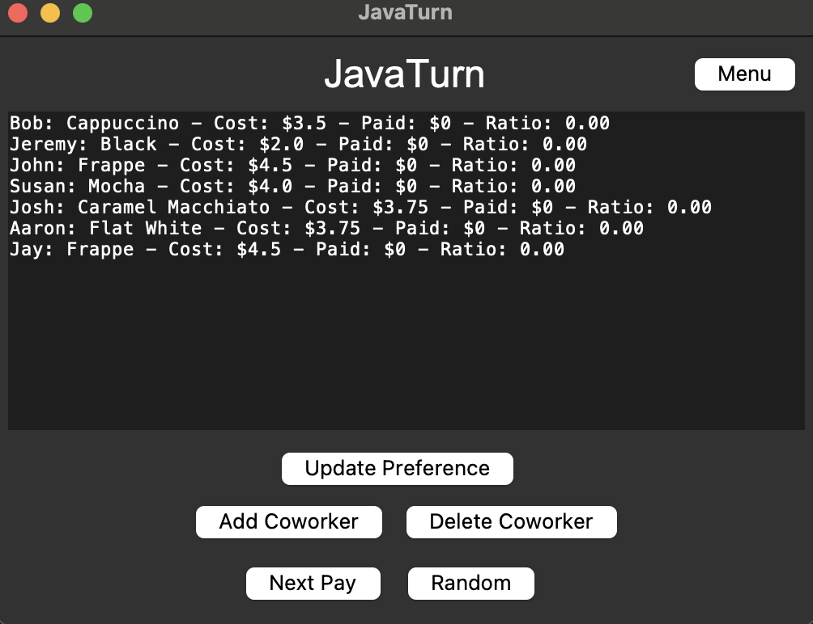

# JavaTurn

## Introduction

At Bertram Labs, Bob, Jeremy, and five colleagues have a daily coffee run after lunch. They all have different coffee preferences, from Bob's cappuccino to Jeremy's black coffee. But deciding who pays each day is tough because their drinks cost different amounts.

That's where JavaTurn comes in. It's a simple software that decides whose turn it is to pay, making sure everyone chips in fairly over time. With JavaTurn, their coffee runs are smooth and hassle-free, keeping everyone happy at Bertram Labs.


*Adding Coworker*

*Displays all information*

*Menu displayed as well*

## Table of Contents

- [Installation](#installation)
- [Assumptions](#assumptions)
- [Usage](#usage)
- [Features](#features)
- [Credits](#credits)


## Installation

JavaTurn is built with Python and Tkinter, ensuring a smooth setup on most systems. To get started, follow these steps:

1. **Clone the repository**:
   ```bash
   git clone https://github.com/yourusername/JavaTurn.git
   cd JavaTurn
   ```

2. **Ensure Python and Tkinter are installed**:
   - JavaTurn requires Python. If you don't have Python installed, download it from [python.org](https://www.python.org/downloads/).
   - Tkinter comes pre-installed with Python. If you need to install it separately, use:
     ```bash
     pip install tk
     ```
## Assumption

When developing JavaTurn, I made several assumptions to base the app to the needs of coffee enthusiasts like those at Bertram Labs:

1. **Participation**: All coworkers participate in coffee runs and are willing to alternate paying.
2. **Price Variability**: Coffee prices vary, creating the need for a fair turn-taking system.
3. **Equity Over Time**: Fairness is measured over multiple runs, considering the cumulative cost paid by each participant.
4. **Input**: Users are expected to input their coffee selections and prices.
5. **Consistent Pricing**: Prices for each coffee type are stable over time.
6. **Group Trust**: Designed for small to medium groups, assuming transparency and trust among users.


## Usage

### Disclaimer

**Mac Users**: Please note that running JavaTurn on macOS might encounter issues with button responsiveness. If you experience difficulty clicking buttons, try dragging the application window slightly. This action can help refresh the window's state and improve button functionality. We're working to address this in future updates and appreciate your understanding.

Follow these steps to make your coffee runs smooth and fair:

1. **Launch JavaTurn**: Run the application by executing:
   ```bash
   python main.py
   ```
2. **Enter Participants**: Add the names and coffee preferences of all coworkers participating.
3. **Log Purchases**: After each coffee run, update the application with the beverages purchased and their costs.
4. **Calculate Next Payer**: JavaTurn will analyze the data and determine who's next to pay, ensuring fairness.

## Features

- **Equitable Tracking**: Balances coffee expenses among participants.
- **Flexible Participation**: Easy to add or remove coworkers.
- **Comprehensive Beverage Support**: Accepts various coffee types and costs.
- **Smart Allocation Algorithm**: Fairly assigns the next payer.
- **Intuitive Interface**: Simple and accessible for all users.

## Contributing

Contributions to JavaTurn are welcome! To contribute:

1. Fork the repository.
2. Create a new branch for your feature (`git checkout -b feature/AmazingFeature`).
3. Commit your changes (`git commit -m 'Add some AmazingFeature'`).
4. Push to the branch (`git push origin feature/AmazingFeature`).
5. Open a Pull Request.

## Credits

JavaTurn was designed and developed by Juhwan Jung

